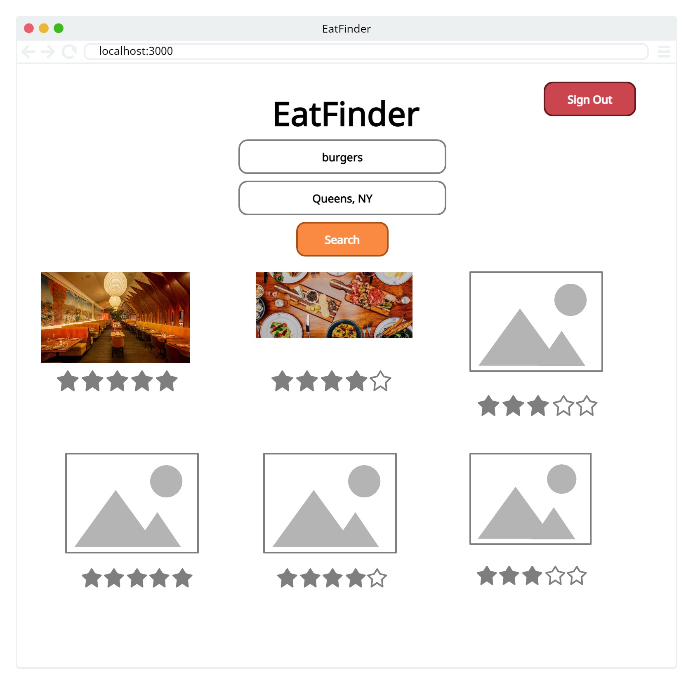
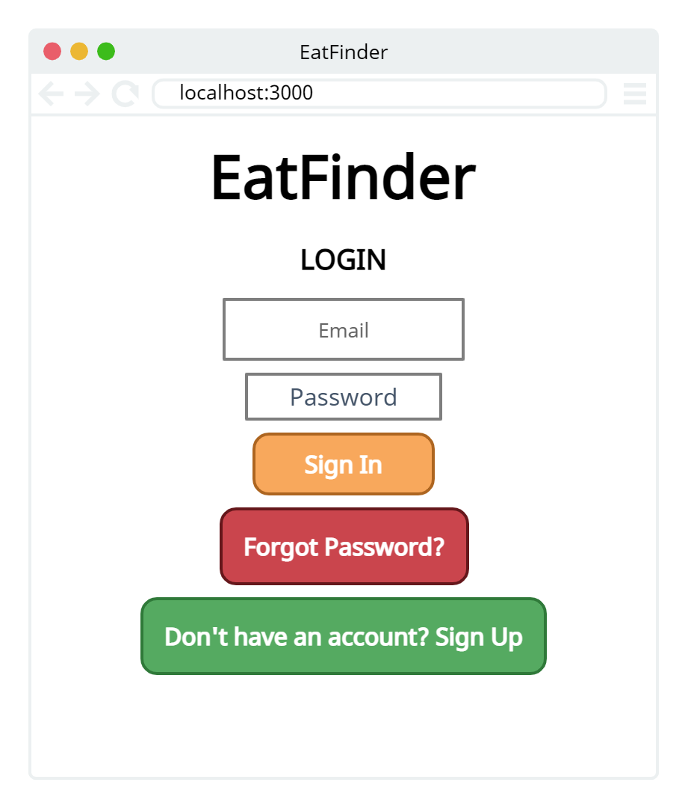
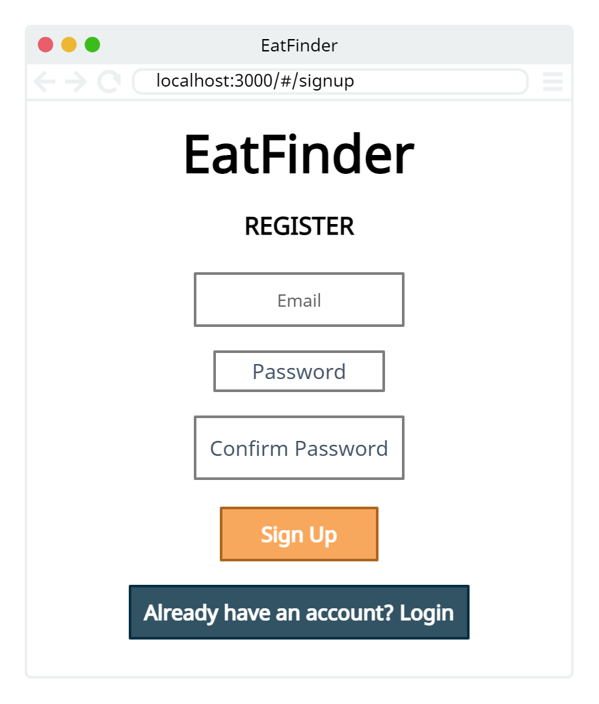
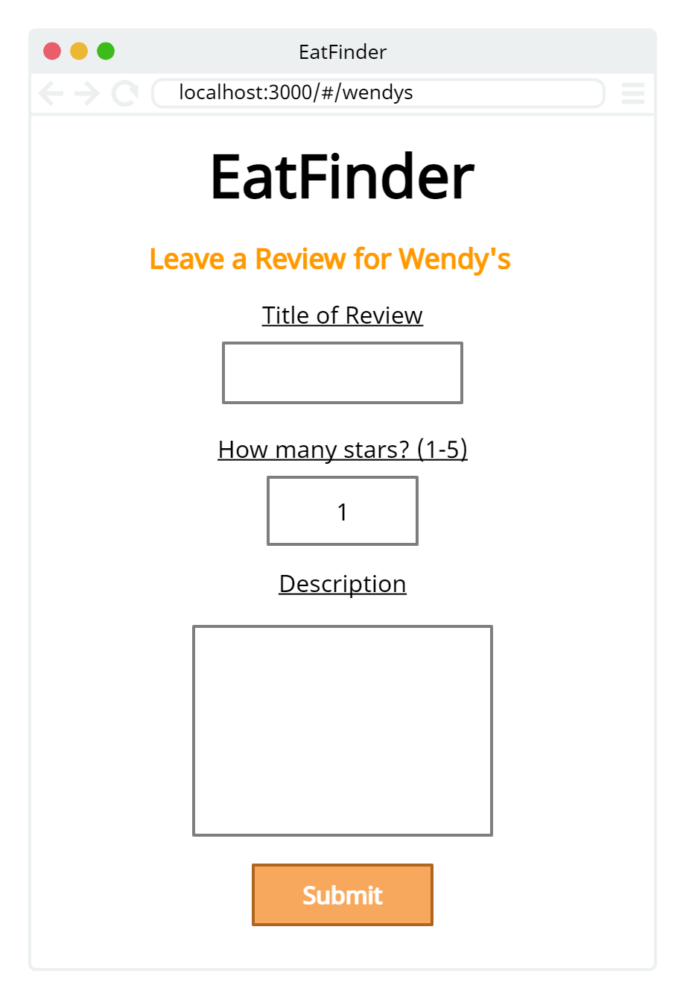
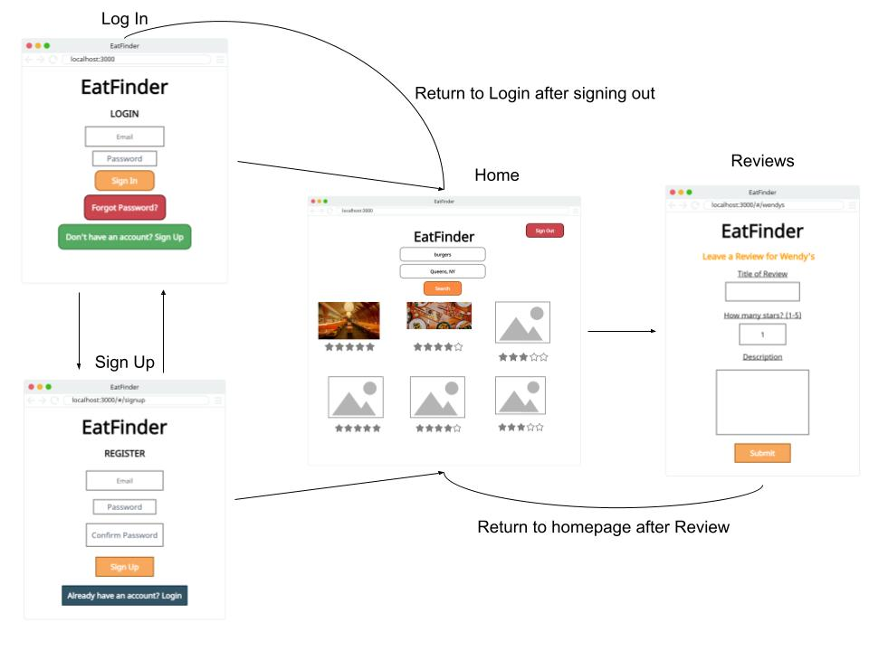

# EatFinder 

## Overview

Have you ever been so hungry you could eat your own laptop? I know I sure have. Well, with EatFinder you can finally find a restaurant fast and easy! We show you the best restaurants in the area and their respective websites so you don't have to. 

EatFinder is a web app that displays restaurants near the user's entered location, lists them by closest match to the searched restaurant, and allows the user to view the restaurants' websites. Moreover, they will be able to leave reviews for restaurants for other users to see.


## Data Model

The application will store restaurants and reviews.

An Example Restaurant:

```javascript
{
  url: // unique url for the restaurant,
  id: // a unique business id
  imageSrc: // url for the restaurant's image,
  name: "Wendy's",
  address: "5 Washington Place",
  city: "New York",
  state: "NY",
  category: // category of the restaurant
  rating: 4.5,
  reviewCount: 100,
  reviews: // an array of reviews referencing the Reviews Schema
}
```

An Example Review:

```javascript
{
  restaurant: // a reference to a Restaurant object,
  title: "Best burger in town!",
  rating: 4.5,
  text: "This place is great!"
}
```

## [Link to Schema](server/db.mjs)

## Wireframes

/ - page for viewing restaurants near the user



/ - page for logging in the user



/#/signup - page for signing up the user



/#/:restaurantname - page for leaving a review for a restaurant


## Site map



## User Stories or Use Cases

1. as non-registered user, I can register a new account with the site
2. as a user, I can visit the home on the site
3. as a user, I can search for a restaurant
4. as a user, I can leave reviews for restaurants

## Research Topics

* (6 points) React
    * used React as the frontend framework; it is a quite difficult a library to learn, so I've assigned it 6 points
* (2 points) tailwindcss
    * used tailwindcss for styling; it's a css framework that I haven't used before, so I've assigned it 2 points
* (2 points) Integrate Firebase for user authentication
    * I'm using Firebase for user authentication
    * Firebase has a javascript module that makes it easy to integrate into a web app

10 points total out of 8 required points

## [Link to Main Project File](server/index.mjs) 

## Annotations / References Used

1. [React docs](https://reactjs.org/)
2. [Tailwindcss docs](https://tailwindcss.com/docs/installation)
3. [Firebase Authentication docs](https://firebase.google.com/docs/auth/web/start)